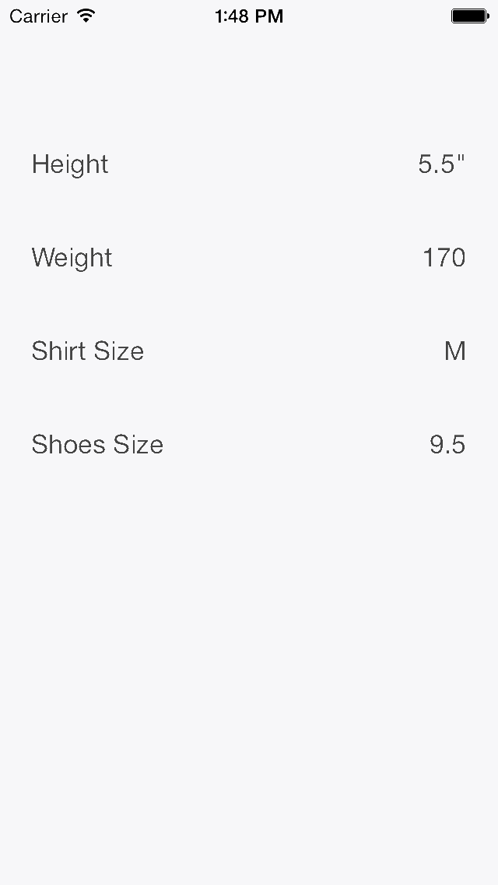

# ODMSwipeSelector

## Usage

To run the example project, clone the repo, and run `pod install` from the Example directory first.

#### From the Interface Builder
To use this control in your views from the interface builder add a UIView and set ODMSwipeSelector as the custom class. Default properties can be set from the Attributes Inspector of the interface builder.

#### Programatically
Create an instance of ODMSwipeSelector add it to your view and set the values of the properties you want to customize.

~~~objective-c
ODMSwipeSelector *heightSelector = [[ODMSwipeSelector alloc] initWithFrame:CGRectMake(0, 20, 320, 50)];
heightSelector.backgroundColor = [UIColor whiteColor];
heightSelector.title = @"Height";
heightSelector.unit = ODMMeasureFormatInch;
heightSelector.value = 5.5;
[self.view addSubview:heightSelector];
~~~

## Requirements

## Installation

ODMSwipeSelector is available through [CocoaPods](http://cocoapods.org). To install
it, simply add the following line to your Podfile:

    pod "ODMSwipeSelector"

## Author

Oscar De Moya
[@odm](http://twitter.com/odm)

## License

ODMSwipeSelector is available under the MIT license. See the LICENSE file for more info.

